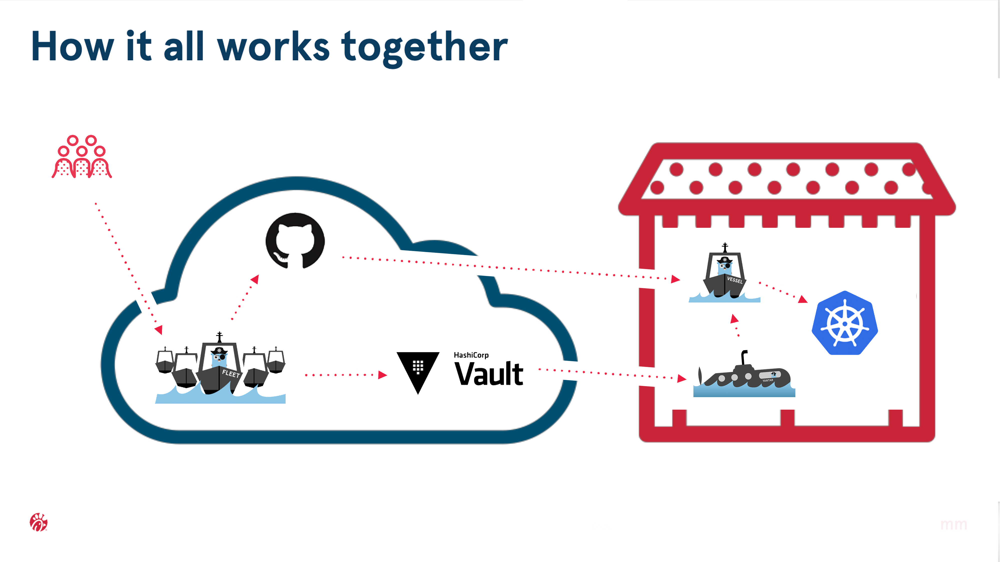

# KubeCon + CloudNativeCon Demo

This demo is open source and is available at https://github.com/chick-fil-a.

Please see [setup](SETUP.md) for instructions on setting up an environment for the demo.

## GitOps




## Gitlab

The [Atlas](http://gitlab.cloud/atlas) is a git repository with a project for each cluster.


## Vault

[Vault](http://vault.cloud:8200/ui/vault/secrets) stores secrets to be distributed to each cluster.


### Weave Cloud

[Weave Cloud](https://cloud.weave.works) is used to visualize the cluster.


## GitOps via Command Line

Simple demonstration of GitOps via the command line.  This is run on the `edge`.

```bash
git clone http://gitlab.cloud/atlas/kubecon.cluster.riot.edge.git

cd kubecon.cluster.riot.edge

# get secrets
vault kv get -field=spec secret/atlas/kubecon.cluster.riot.edge/podinfo/secret.yaml > podinfo/secret.yaml 

# apply
kubectl apply -f . --recursive -l heritage=Fleet --prune \
  --prune-whitelist /v1/ConfigMap \
  --prune-whitelist /v1/Secret \
  --prune-whitelist /v1/ConfigMap \
  --prune-whitelist /v1/Secret \
  --prune-whitelist /v1/Service \
  --prune-whitelist /v1/ServiceAccount \
  --prune-whitelist apps/v1/DaemonSet  \
  --prune-whitelist apps/v1/Deployment  \
  --prune-whitelist apps/v1beta1/Deployment  \
  --prune-whitelist autoscaling/v2beta1/HorizontalPodAutoscaler  \
  --prune-whitelist extensions/v1beta1/Deployment  \
  --prune-whitelist extensions/v1beta1/Ingress  \
  --prune-whitelist storage.k8s.io/v1/StorageClass  \
  --prune-whitelist rbac.authorization.k8s.io/v1/ClusterRole  \
  --prune-whitelist rbac.authorization.k8s.io/v1/ClusterRoleBinding
```

## GitOps via Vessel

Demonstrate vessel run on the `edge`.

```bash
kubectl apply -f vessel

kubectl -n kube-system get po

kubectl -n kube-system logs <pod> -f
```

## Caveats with Kubectl Apply with Prune

- Apply is run in only one namespace.  In order to be namespace specific, the Namespace: metadata must be provided.
- In order to prune resources no longer in the repository, Heritage: Fleet label is used.
- If all k8s resources need to be removed, must have at least one resource per namespace, see empty.yaml.
- There is an incomplete default whitelist of resource, so --prune-whitelist must be provided.  See [https://github.com/kubernetes/kubernetes/blob/b1aed1593e5c22a5f7fa4890fc87808dca9ad9e1/pkg/kubectl/cmd/apply/apply.go](getRESTMappings in apply.go)
- Any resource that creates another resource must add Heritage: Fleet
- Must be run multiple times as it does not order resource dependencies

## Empty

To prune all Fleet resources:

```bash
kubectl apply -f empty.yaml -l heritage=Fleet --prune \
  --prune-whitelist /v1/ConfigMap \
  --prune-whitelist /v1/Secret \
  --prune-whitelist /v1/ConfigMap \
  --prune-whitelist /v1/Secret \
  --prune-whitelist /v1/Service \
  --prune-whitelist /v1/ServiceAccount \
  --prune-whitelist apps/v1/DaemonSet  \
  --prune-whitelist apps/v1/Deployment  \
  --prune-whitelist apps/v1beta1/Deployment  \
  --prune-whitelist autoscaling/v2beta1/HorizontalPodAutoscaler  \
  --prune-whitelist extensions/v1beta1/Deployment  \
  --prune-whitelist extensions/v1beta1/Ingress  \
  --prune-whitelist storage.k8s.io/v1/StorageClass  \
  --prune-whitelist rbac.authorization.k8s.io/v1/ClusterRole  \
  --prune-whitelist rbac.authorization.k8s.io/v1/ClusterRoleBinding
```